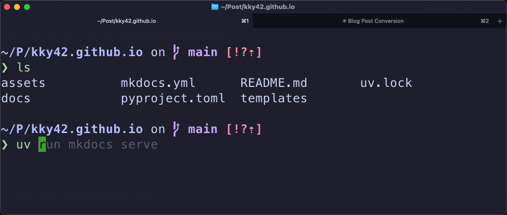
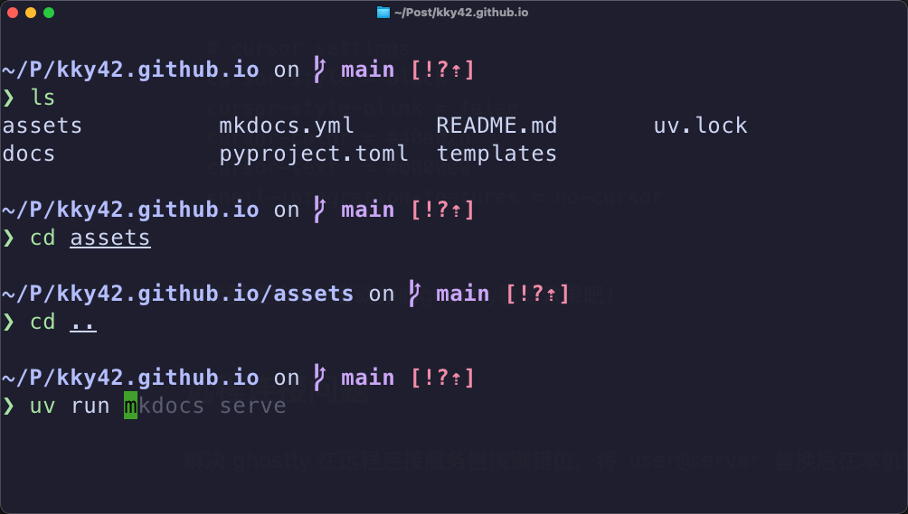

# Mac 终端终极配置指南

1. 快速的终端体验 -> Ghostty
2. 让眼睛愉悦的审美 -> catppuccin
3. 个性化终端显示 -> starship
4. 终端命令补全及高亮 -> zsh-autosuggestions

{ width="70%" }

<!-- more -->

## 安装

```shell
brew install --cask ghostty           # 终端
brew install starship                 # 终端自定义
brew install font-meslo-lg-nerd-font  # 图标字体支持
brew install zsh-autosuggestions      # 终端命令自动提示及补全
brew install zsh-syntax-highlighting  # 终端语法高亮
```

追加如下命令到`~/.zshrc`末尾：

```shell
source /opt/homebrew/share/zsh-autosuggestions/zsh-autosuggestions.zsh
source $(brew --prefix)/share/zsh-syntax-highlighting/zsh-syntax-highlighting.zsh
eval "$(starship init zsh)"
```

## 🍉starship

我的配置主要参照[官方配置说明](https://starship.rs/config/)并结合[catppuccin](https://github.com/catppuccin/starship/blob/main/starship.toml)的审美调教。首先运行如下命令创建配置文件。

```shell
mkdir -p ~/.config && touch ~/.config/starship.toml
```

具体配置方面 : )

- 采用mocha配色主题
-  取消了命令行前缀变色的逻辑（无效信息）
- 命令行显示针对超长路径进行优化，只显示最后2层的完整路径，前缀路径只显示第一个字母
- 关闭了一些关于username/hostname/package version等的显示

```toml
"$schema" = 'https://starship.rs/config-schema.json'
palette = "catppuccin_mocha"
add_newline = true

[git_branch]
style = "bold mauve"

[directory]
format = "[$path]($style) "
style  = "bold lavender"

# 借鉴 p10k “shortened”：除最后一段外，每段取前 N 个字符
fish_style_pwd_dir_length = 1   # 1=首字母，2=前两字母…
truncation_length = 2           # 最多显示 n 段
truncation_symbol = "…/"        # 省略号样式
truncate_to_repo  = true        # 进入仓库后从仓库根开始计数
home_symbol       = "~"         # 家目录符号

[username]
disabled = true
[hostname]
disabled = true
[time]
disabled = true
[package]
disabled = true
[nodejs]
disabled = true
[python]
disabled = true
[gcloud]
disabled = true

[palettes.catppuccin_mocha]
rosewater = "#f5e0dc"
flamingo = "#f2cdcd"
pink = "#f5c2e7"
mauve = "#cba6f7"
red = "#f38ba8"
maroon = "#eba0ac"
peach = "#fab387"
yellow = "#f9e2af"
green = "#a6e3a1"
teal = "#94e2d5"
sky = "#89dceb"
sapphire = "#74c7ec"
blue = "#89b4fa"
lavender = "#b4befe"
text = "#cdd6f4"
subtext1 = "#bac2de"
subtext0 = "#a6adc8"
overlay2 = "#9399b2"
overlay1 = "#7f849c"
overlay0 = "#6c7086"
surface2 = "#585b70"
surface1 = "#45475a"
surface0 = "#313244"
base = "#1e1e2e"
mantle = "#181825"
crust = "#11111b"
```

## Ghostty

创建配置文件夹及配置文件。

```shell
mkdir -p ~/.config/ghostty/themes && touch ~/.config/ghostty/config
```

下载 [catppuccin主题文件](https://github.com/catppuccin/ghostty/tree/main/themes)到 `~/.config/ghostty/themes` 路径中，配置`~/.config/ghostty/config` 文件。

```
theme = catppuccin-mocha.conf

font-family = MesloLGS Nerd Font Mono
font-size = 24
window-width = 90
window-height = 30
background-opacity = 0.99

keybind = shift+enter=text:\n
keybind = global:cmd+backslash=toggle_visibility
# keybind = cmd+shift+comma=reload_config

# cursor settings
cursor-style = block
cursor-style-blink = false
cursor-color = #40a02b
cursor-text  = #000000
shell-integration-features = no-cursor
```

到此配置结束，启动你的ghostty看看效果吧！

{ width="50%" }
## Tips

- **命令部分补全**，使用 `->` 可以完整接受命令补全结果，使用`option + ->`可移动光标进行部分补全

- **Ghostty远程连接按键错位**，ghostty在ssh连接remote server可能会出现按键错位，将 `user@server` 替换后在执行：
```shell
infocmp -x xterm-ghostty | ssh user@server -- 'tic -x -o ~/.terminfo -'
```
- Ghostty窗口重命名，这个在使用Git worktree配合 Claude Code等Coding Agent Cli时特别有用，首先通过`command + shift + p`招出命令搜索界面，输入`title`就可以看到`change title`的命令了，然后重命名即可！