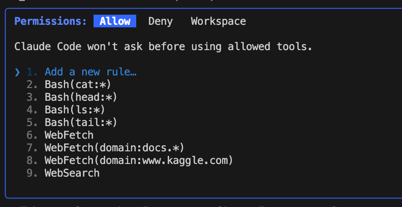

# Claude Code Configuration Guide

## Config Scopes and Files

| File Location | Purpose | Scope | Key Settings | Shared/Private |
|---------------|---------|-------|--------------|----------------|
| `~/.claude/settings.json` | User-wide settings [[1]](#ref-1) | User | Permissions, hooks, models | Private |
| `.claude/settings.json` | Project-wide settings [[1]](#ref-1) | Project | Permissions, hooks, models | Shared (git) |
| `.claude/settings.local.json` | Project-local settings [[1]](#ref-1) | Project Local | Permissions, hooks, models | Private (gitignored) |
| `~/.claude.json` | User MCP servers [[2]](#ref-2) | User | MCP server configs | Private |
| `.mcp.json` | Project MCP servers [[2]](#ref-2) | Project | MCP server configs | Shared (git) |
| CLI `--add-dir` | Temporary directory access [[3]](#ref-3) | Session | Additional directories | Temporary |

### Precedence Order
1. Enterprise policies
2. Command line arguments
3. Local project settings
4. Shared project settings
5. User settings

## Permissions

### Managing Permissions in Claude Code

```bash
# In Claude Code, type the following command
/permission
```

You can see permission list defined across all scopes. Add a new rule or select an existing one to delete. All modifications take effect immediately.

### Configuration File Structure

You can modify permissions manually by editing the corresponding config file at any scope:

```json
{
  "permissions": {
    "allow": [
      "Bash(ls:*)",
      "Bash(tail:*)",
      "Bash(head:*)",
      "WebFetch(domain:www.kaggle.com)",
      "WebFetch(domain:docs.*)",
      "WebSearch"
    ],
    "deny": [
      "Bash(rm -rf: *)"
    ],
    "additionalDirectories": [
      "../docs/",
      "/path/to/another/directory"
    ]
  }
}
```

### Directory Access Permissions

#### Persistent Directory Access

Grant Claude access to directories outside your current project by adding `additionalDirectories` under the `permissions` section:

- **User scope**: `~/.claude/settings.json`
- **Project scope**: `.claude/settings.json`
- **Local scope**: `.claude/settings.local.json`

The `additionalDirectories` array accepts relative paths (like `../docs/`) or absolute paths.

#### Temporary Directory Access

For temporary access during a single session, use the `/add-dir` slash command:

```bash
/add-dir /path/to/directory
```

This uses the `--add-dir` CLI flag and only grants access for the current session. It's not stored in any configuration file.

**Note**: Restart Claude Code for persistent configuration changes to take effect.

### Tool Permission Types

#### Default Tool Permissions

Some core tools are **automatically allowed by default** and don't require explicit permission entries:

**Always Available (No Permission Required):**
- `Glob` - File pattern matching
- `Grep` - Text search in files
- `LS` - Directory listing
- `Read` - Reading files
- `NotebookRead` - Reading Jupyter notebooks
- `Task` - Launching sub-agents
- `TodoWrite` - Task management
- `WebSearch` - Web searching (Note: Some users report this requires permission in certain versions - check your setup if it doesn't work)

**Require Explicit Permission:**
- `Bash` - Shell commands (potentially dangerous)
- `Edit` / `MultiEdit` / `Write` - File modifications
- `NotebookEdit` - Modifying Jupyter notebooks
- `WebFetch` - External web requests

#### Configurable Tool Permissions

For tools that require explicit permissions, you can configure them in different ways:

**General permissions (allow all):**
- `"Bash"` - allows all bash commands
- `"WebFetch"` - allows fetching from any domain  
- `"WebSearch"` - allows all web search requests

**Specific restrictions:**
- `"Bash(command:*)"` - allows specific bash commands with wildcards
- `"WebFetch(domain:example.com)"` - allows fetching only from specified domains
- `"WebFetch(domain:*.github.com)"` - allows fetching from subdomains using wildcards
- `"WebSearch(domain:example.com)"` - restricts web search to specific domains

**Real-world examples:**
```json
"allow": [
  "WebFetch",
  "WebSearch", 
  "WebFetch(domain:github.com)",
  "WebFetch(domain:docs.anthropic.com)", 
  "WebFetch(domain:stackoverflow.com)",
  "WebFetch(domain:*.github.com)",
  "Bash(git:*)",
  "Bash(npm:*)",
  "Bash(node:*)"
]
```


## Hooks Configuration

Hooks are shell commands that execute automatically at specific points in Claude Code's lifecycle.

### Hooks Config Files (by scope)

- **User scope**: `~/.claude/settings.json`
- **Project scope** (shared): `.claude/settings.json`
- **Local scope** (private): `.claude/settings.local.json`

### Key Hook Events Available:
- `UserPromptSubmit` - Before Claude processes your prompt
- `PreToolUse` - Before any tool execution  
- `PostToolUse` - After tool completes
- `Notification` - When Claude sends notifications
- `Stop` - When main agent finishes
- `SubagentStop` - When subagent finishes

### Example Hook Configuration:
```json
{
  "hooks": {
    "Notification": [
      {
        "matcher": "",
        "hooks": [
          {
            "type": "command",
            "command": "jq -r '.message' | grep -vFx 'Claude is waiting for your input' && say -v Ava \"Your agent needs your attention\""
          }
        ]
      }
    ],
    "Stop": [
      {
        "matcher": "",
        "hooks": [
          {
            "type": "command",
            "command": "say -v Ava \"Job complete\""
          }
        ]
      }
    ]
  }
}
```

### Best Practices:
- Always quote variables: `"$VAR"` not `$VAR`
- Use matchers to target specific tools/conditions
- Keep hooks lightweight to avoid slowing down Claude
- Test hooks carefully - they execute automatically

## MCP Servers Configuration

MCP (Model Context Protocol) allows Claude Code to connect to external tools and services.

### MCP Config Locations (by scope)

- **User scope** (Claude Code, available in all your projects):
  - `~/.claude.json`
- **Project scope** (shared via .mcp.json):
  - `/path/to/your/project/.mcp.json`
- **Local scope** (private to you in this project):
  - Project-specific user settings (managed via Claude Code)

**Note**: Claude Desktop uses a different configuration file (`claude_desktop_config.json`) located in the system application support directory, which is separate from Claude Code's configuration.

### Using Claude CLI Commands

**Example 1: Simple MCP server (memory)**
```bash
claude mcp add -s user server-memory -- npx -y @modelcontextprotocol/server-memory
```
*Configuration stored in: `~/.claude.json`*

**Why the `--` separator is needed:**
The `--` tells the CLI parser to stop processing flags and treat everything after it as the actual MCP server command. Without it, the CLI might interpret MCP server arguments (like `-y` in `npx -y`) as Claude CLI flags, causing parsing errors.

**Example 2: MCP server with environment variables**
```bash
claude mcp add -s project brave-search -e BRAVE_API_KEY=your-api-key -- npx -y @modelcontextprotocol/server-brave-search
```
*Configuration stored in: `.mcp.json`*

### Management Commands
```bash
# List all MCP servers
claude mcp list

# Remove a server  
claude mcp remove server-name
```

### Modify MCP configuration in file

You can also add and delete MCP servers in `.mcp.json` — at project scope and in `~/.claude.json` — at user scope.

```json
{
  "mcpServers": {
    "server-memory": {
      "command": "npx",
      "args": ["-y", "@modelcontextprotocol/server-memory"]
    },
    "brave-search": {
      "command": "npx",
      "args": ["-y", "@modelcontextprotocol/server-brave-search"],
      "env": {
        "BRAVE_API_KEY": "your-api-key"
      }
    }
  }
}
```

## References

<a id="ref-1"></a>[1] Anthropic. "Claude Code settings - Anthropic." *Claude Code Documentation*. https://docs.anthropic.com/en/docs/claude-code/settings

<a id="ref-2"></a>[2] Anthropic. "Model Context Protocol (MCP) - Anthropic." *Claude Code Documentation*. https://docs.anthropic.com/en/docs/claude-code/mcp

<a id="ref-3"></a>[3] Anthropic. "Claude Code CLI Reference." *Claude Code Documentation*. Based on `claude --help` command output and community documentation.

